# Laboratorio 02 – Implementar objetos de programabilidad con SQL

**Entorno:** SQL Server + SSMS · Base de datos de ejemplo **AdventureWorksLT2025** (esquema `SalesLT`)
**Enunciado:** [Implement programmability objects with SQL – Microsoft Learn](https://microsoftlearning.github.io/mslearn-sql-developer/Instructions/Labs/02-implement-programmability-objects.html)

## Objetivo

Centralizar lógica dentro de la base de datos para mejorar la mantenibilidad, creando y probando los objetos de programabilidad principales de SQL Server:

| Objeto | Nombre | Para qué sirve |
|---|---|---|
| Vista | `SalesLT.vCustomerOrders` | Ocultar la complejidad de un `JOIN` |
| Procedimiento almacenado | `dbo.AddOrderLineItem` | Encapsular una operación de negocio transaccional |
| Función escalar | `dbo.fnOrderTotal` | Cálculo reutilizable que devuelve un único valor |
| Función con valores de tabla (TVF) | `dbo.GetCustomerOrders` | Devolver un conjunto de filas parametrizado |
| Trigger | `SalesLT.trg_LogOrderTotalChange` | Reaccionar automáticamente a cambios (auditoría) |

Los apartados se han ejecutado en este mismo orden sobre una base de datos recién restaurada, porque el orden importa: cada objeto se apoya en los anteriores y el trigger solo audita lo que ocurre **después** de crearlo.

---

## 1. Conexión y verificación de AdventureWorksLT2025

Antes de crear nada compruebo que la base de datos está restaurada y que tengo acceso de lectura a las tablas que voy a usar.

```sql
SELECT TOP (5) CustomerID, FirstName, LastName FROM SalesLT.Customer;
SELECT TOP (5) SalesOrderID, OrderDate, CustomerID FROM SalesLT.SalesOrderHeader;
SELECT TOP (5) ProductID, Name, ListPrice FROM SalesLT.Product;
```

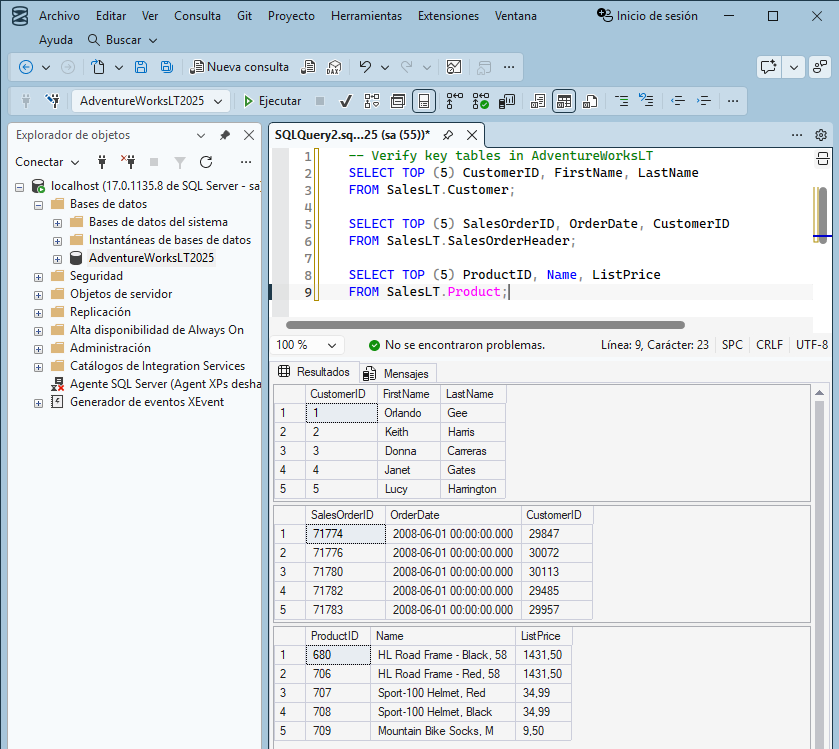

**Resultado:** se obtienen tres conjuntos de resultados (clientes, pedidos y productos) de hasta 5 filas cada uno, lo que confirma que la conexión y la base de datos funcionan correctamente.

---

## 2. Vista para simplificar consultas

### 2.1 Crear la vista

La vista une clientes y cabeceras de pedido. La aplicación ya no necesita escribir el `JOIN`: consulta la vista como si fuera una tabla.

```sql
CREATE OR ALTER VIEW SalesLT.vCustomerOrders AS
SELECT
    c.CustomerID,
    CONCAT(c.FirstName, ' ', c.LastName) AS CustomerName,
    h.SalesOrderID,
    h.OrderDate
FROM SalesLT.Customer c
INNER JOIN SalesLT.SalesOrderHeader h ON c.CustomerID = h.CustomerID;
```

- `CREATE OR ALTER` crea la vista o la sobrescribe si ya existe (permite relanzar el script sin errores).
- `CONCAT` genera el nombre completo del cliente en una sola columna.
- `INNER JOIN` solo devuelve clientes que tienen al menos un pedido.

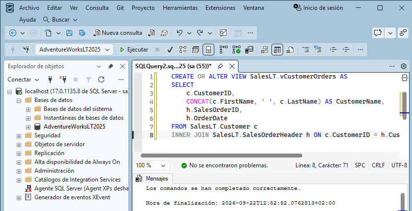

### 2.2 Validar la vista

```sql
SELECT TOP (5) * FROM SalesLT.vCustomerOrders ORDER BY OrderDate DESC;
```

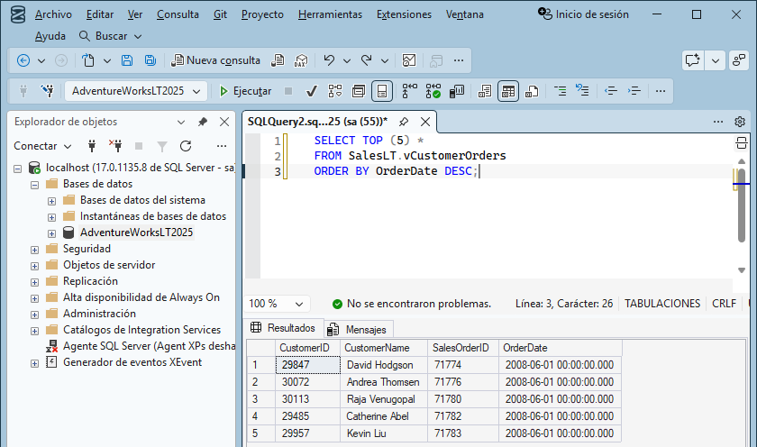

**Resultado:** los 5 pedidos más recientes con `CustomerID`, nombre completo, `SalesOrderID` y `OrderDate`, sin haber escrito ningún `JOIN` en la consulta.

---

## 3. Procedimiento almacenado para procesar un pedido

### 3.1 Crear el procedimiento

`dbo.AddOrderLineItem` añade una línea a un pedido existente y recalcula el subtotal de la cabecera, todo dentro de una **transacción**.

```sql
CREATE OR ALTER PROCEDURE dbo.AddOrderLineItem
    @SalesOrderID INT,
    @ProductID    INT,
    @Quantity     INT
AS
BEGIN
    SET NOCOUNT ON;
    BEGIN TRANSACTION;

    DECLARE @UnitPrice DECIMAL(18,2);
    SELECT @UnitPrice = CAST(ListPrice AS DECIMAL(18,2))
    FROM SalesLT.Product WHERE ProductID = @ProductID;

    IF @UnitPrice IS NULL
    BEGIN
        ROLLBACK TRANSACTION;
        THROW 50010, 'Invalid ProductID specified.', 1;
    END

    IF NOT EXISTS (SELECT 1 FROM SalesLT.SalesOrderHeader WHERE SalesOrderID = @SalesOrderID)
    BEGIN
        ROLLBACK TRANSACTION;
        THROW 50011, 'Invalid SalesOrderID specified.', 1;
    END

    INSERT INTO SalesLT.SalesOrderDetail (SalesOrderID, OrderQty, ProductID, UnitPrice, UnitPriceDiscount)
    VALUES (@SalesOrderID, @Quantity, @ProductID, @UnitPrice, 0);

    UPDATE h
    SET SubTotal = d.SumLineTotal, ModifiedDate = SYSUTCDATETIME()
    FROM SalesLT.SalesOrderHeader h
    INNER JOIN (
        SELECT SalesOrderID, SUM(LineTotal) AS SumLineTotal
        FROM SalesLT.SalesOrderDetail
        WHERE SalesOrderID = @SalesOrderID
        GROUP BY SalesOrderID
    ) d ON d.SalesOrderID = h.SalesOrderID;

    COMMIT TRANSACTION;
END;
```

Funcionamiento paso a paso:

1. **Validación del producto:** toma su `ListPrice` como precio unitario; si no existe → `ROLLBACK` + error 50010.
2. **Validación del pedido:** si el `SalesOrderID` no existe → `ROLLBACK` + error 50011.
3. **Inserción** de la línea en `SalesOrderDetail` (sin descuento).
4. **Recálculo** del `SubTotal` de la cabecera sumando `LineTotal` de todas sus líneas.
5. **`COMMIT`:** la operación es **atómica**; o se aplican todos los cambios o ninguno.

`SET NOCOUNT ON` evita los mensajes "(n rows affected)", que añaden tráfico innecesario.

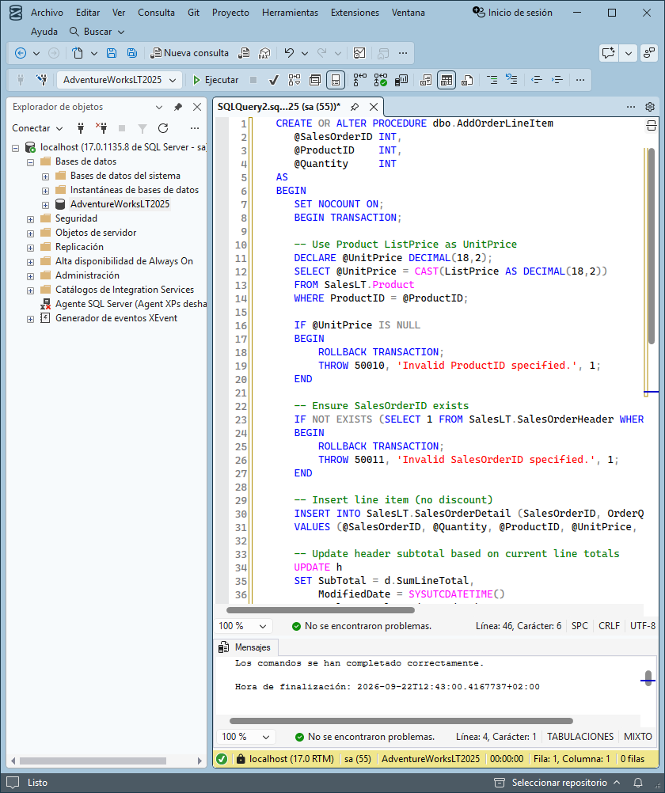

### 3.2 Probar el procedimiento

Se usa el último pedido existente y el producto 680, cantidad 1:

```sql
DECLARE @SalesOrderID INT = (SELECT TOP 1 SalesOrderID
                             FROM SalesLT.SalesOrderHeader
                             ORDER BY SalesOrderID DESC);

EXEC dbo.AddOrderLineItem @SalesOrderID = @SalesOrderID, @ProductID = 680, @Quantity = 1;

SELECT TOP (5) * FROM SalesLT.SalesOrderDetail
WHERE SalesOrderID = @SalesOrderID ORDER BY SalesOrderDetailID DESC;

SELECT SalesOrderID, SubTotal, TaxAmt, Freight, TotalDue
FROM SalesLT.SalesOrderHeader WHERE SalesOrderID = @SalesOrderID;
```

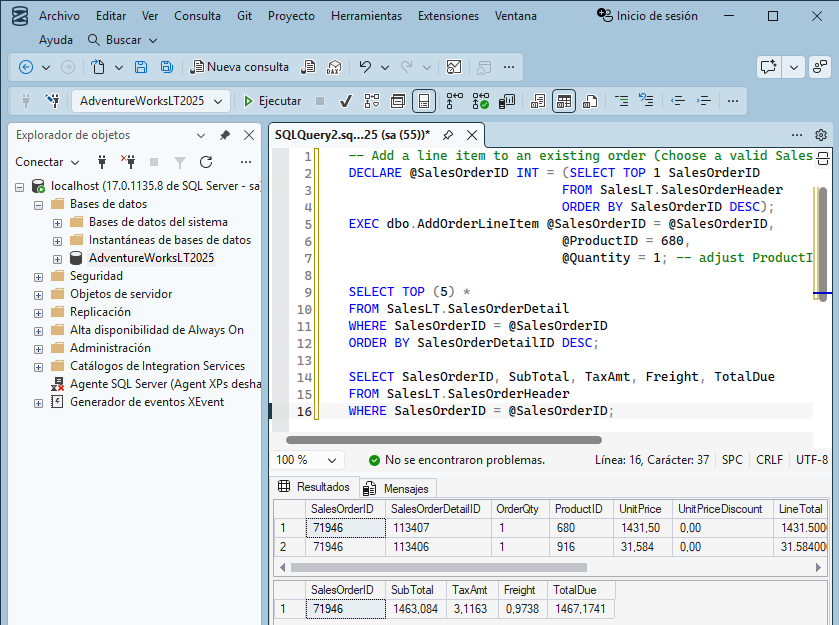

**Resultado:** la nueva línea (ProductID 680, precio 1431,50) aparece la primera en el detalle del pedido 71946, y la cabecera muestra el `SubTotal` actualizado a 1463,084. `TotalDue` también cambia porque es una columna calculada a partir de `SubTotal + TaxAmt + Freight`.

> Matiz importante: el procedimiento recalcula el `SubTotal`, pero **no** `TaxAmt` ni `Freight`, que siguen siendo los del pedido original (3,1163 y 0,9738). Por eso el `TotalDue` resultante es coherente con la fórmula de la columna calculada, pero no con las reglas de negocio reales: para que lo fuera habría que recalcular también impuestos y portes a partir del nuevo subtotal.

---

## 4. Función escalar para cálculos reutilizables

### 4.1 Crear la función

Una función escalar devuelve **un único valor**. `dbo.fnOrderTotal` devuelve el importe total de un pedido.

```sql
CREATE OR ALTER FUNCTION dbo.fnOrderTotal (@OrderID INT)
RETURNS DECIMAL(18,2)
AS
BEGIN
    DECLARE @Total DECIMAL(18,2);

    SELECT @Total = SUM(LineTotal)
    FROM SalesLT.SalesOrderDetail
    WHERE SalesOrderID = @OrderID;

    RETURN ISNULL(@Total, 0.00);
END;
```

`ISNULL` garantiza que un pedido sin líneas devuelva `0.00` en lugar de `NULL`.

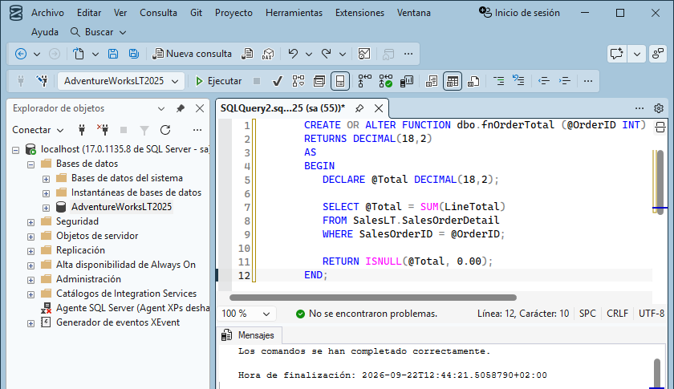

### 4.2 Usar la función

```sql
SELECT d.SalesOrderID, dbo.fnOrderTotal(d.SalesOrderID) AS OrderTotal
FROM SalesLT.SalesOrderDetail d
GROUP BY d.SalesOrderID
ORDER BY d.SalesOrderID DESC;
```

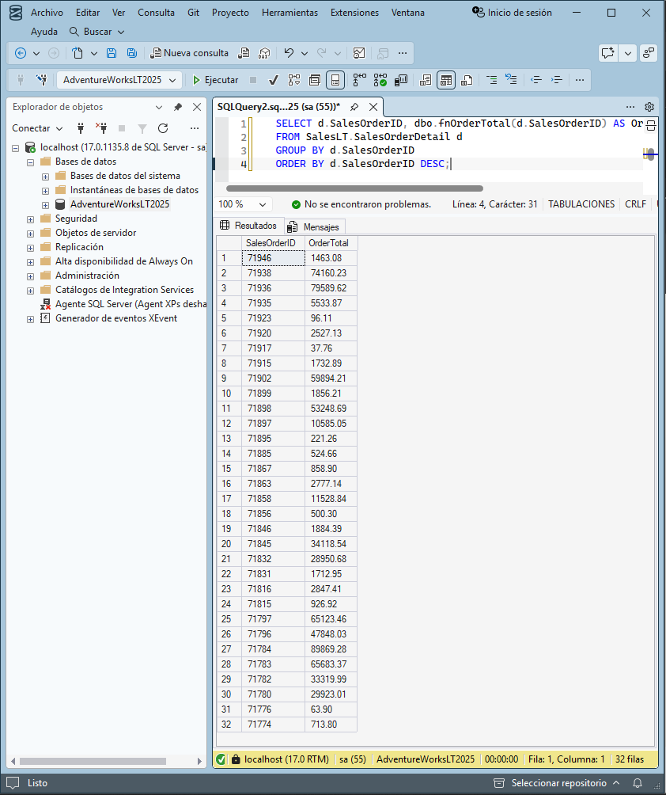

**Resultado:** un total por pedido (32 filas). El pedido 71946 devuelve 1463,08, el mismo importe que el `SubTotal` que dejó el procedimiento en el apartado anterior, lo que confirma que ambos cálculos son consistentes. La función se usa dentro del `SELECT` como cualquier función nativa, y la lógica del cálculo queda en un solo sitio.

> Nota: las funciones escalares se ejecutan fila a fila; en tablas grandes pueden penalizar el rendimiento frente a un `SUM` con `GROUP BY` directo.

---

## 5. Función con valores de tabla en línea (TVF)

### 5.1 Crear la TVF

Una TVF en línea devuelve una **tabla** a partir de un parámetro: se comporta como una "vista con parámetros".

```sql
CREATE OR ALTER FUNCTION dbo.GetCustomerOrders (@CustomerID INT)
RETURNS TABLE
AS
RETURN
(
    SELECT h.SalesOrderID, h.OrderDate
    FROM SalesLT.SalesOrderHeader h
    WHERE h.CustomerID = @CustomerID
);
```

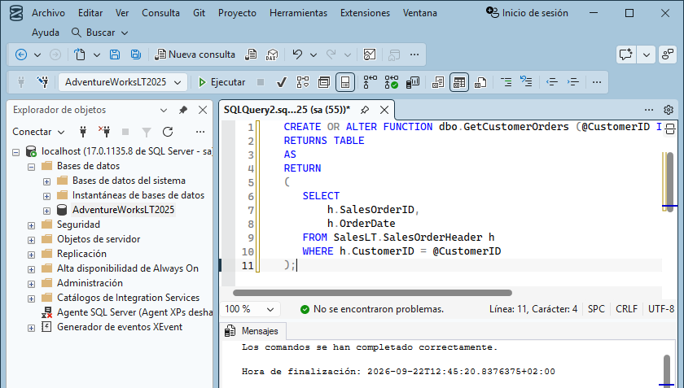

### 5.2 Consultar la TVF

Se usa en el `FROM` igual que una tabla:

```sql
SELECT * FROM dbo.GetCustomerOrders(29929) ORDER BY OrderDate DESC;
```

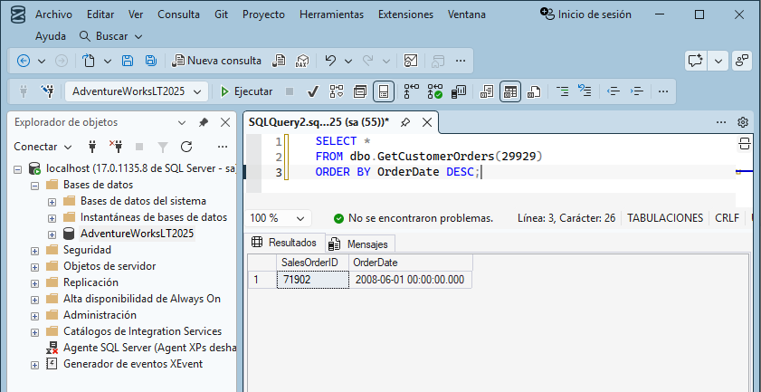

**Resultado:** el cliente 29929 tiene un único pedido, el 71902, con su `OrderDate`. La función devuelve una tabla de una sola fila.

### 5.3 Combinar la TVF con otras tablas (`CROSS APPLY`)

```sql
SELECT CONCAT(c.FirstName, ' ', c.LastName) AS CustomerName, o.SalesOrderID, o.OrderDate
FROM SalesLT.Customer c
    CROSS APPLY dbo.GetCustomerOrders(c.CustomerID) o
WHERE c.CustomerID = 29929;
```

`CROSS APPLY` ejecuta la función **por cada fila** de `Customer`, pasándole su `CustomerID`. Un `JOIN` normal no puede pasar columnas de la tabla izquierda como parámetro de una función; `APPLY` sí.

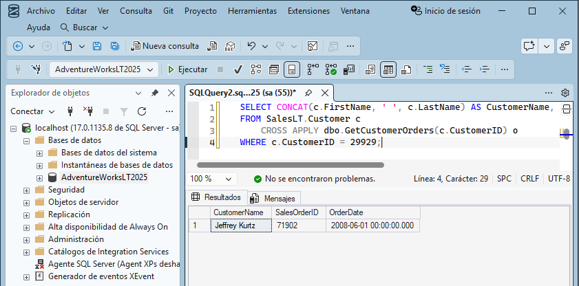

**Resultado:** el mismo pedido 71902, pero ahora acompañado del nombre del cliente (Jeffrey Kurtz).

---

## 6. Trigger para registrar cambios (auditoría)

### 6.1 Crear la tabla de auditoría y el trigger

Primero se crea `dbo.OrderAudit` (solo si no existe) y después el trigger `AFTER INSERT, UPDATE` sobre `SalesLT.SalesOrderDetail`.

```sql
IF OBJECT_ID('dbo.OrderAudit') IS NULL
BEGIN
    CREATE TABLE dbo.OrderAudit (
        AuditID   INT IDENTITY(1,1) PRIMARY KEY,
        OrderID   INT NOT NULL,
        OldTotal  DECIMAL(18,2) NULL,
        NewTotal  DECIMAL(18,2) NULL,
        ChangedAt DATETIME2 NOT NULL DEFAULT SYSUTCDATETIME()
    );
END
GO

CREATE OR ALTER TRIGGER SalesLT.trg_LogOrderTotalChange
ON SalesLT.SalesOrderDetail
AFTER INSERT, UPDATE
AS
BEGIN
    SET NOCOUNT ON;

    ;WITH AffectedOrders AS (
        SELECT SalesOrderID FROM inserted
        UNION
        SELECT SalesOrderID FROM deleted
    ),
    NewTotals AS (
        SELECT d.SalesOrderID, SUM(d.OrderQty * d.UnitPrice) AS Total
        FROM SalesLT.SalesOrderDetail d
        INNER JOIN AffectedOrders a ON d.SalesOrderID = a.SalesOrderID
        GROUP BY d.SalesOrderID
    ),
    InsertedTotals AS (
        SELECT SalesOrderID, SUM(OrderQty * UnitPrice) AS Total
        FROM inserted GROUP BY SalesOrderID
    ),
    DeletedTotals AS (
        SELECT SalesOrderID, SUM(OrderQty * UnitPrice) AS Total
        FROM deleted GROUP BY SalesOrderID
    )
    INSERT INTO dbo.OrderAudit (OrderID, OldTotal, NewTotal)
    SELECT
        n.SalesOrderID,
        n.Total - ISNULL(i.Total, 0) + ISNULL(d.Total, 0) AS OldTotal,
        n.Total AS NewTotal
    FROM NewTotals n
    LEFT JOIN InsertedTotals i ON n.SalesOrderID = i.SalesOrderID
    LEFT JOIN DeletedTotals d ON n.SalesOrderID = d.SalesOrderID;
END;
```

Claves para entenderlo:

- **`inserted` / `deleted`**: tablas virtuales del trigger. `inserted` tiene las filas nuevas (o su versión nueva en un `UPDATE`); `deleted` tiene la versión anterior (vacía en un `INSERT`).
- **`GO`** separa lotes. `CREATE TRIGGER` tiene que ser la primera instrucción de su lote, y lo mismo ocurre con `CREATE VIEW`, `CREATE FUNCTION` y `CREATE PROCEDURE`: por eso hay que cerrar el bloque de la tabla antes de empezar el del trigger.
- **CTEs (`WITH`)**:
  - `AffectedOrders`: pedidos afectados por el cambio.
  - `NewTotals`: total actual del pedido (la tabla base ya refleja el cambio porque el trigger es `AFTER`).
  - `InsertedTotals` / `DeletedTotals`: aportación de las filas nuevas y antiguas.
- **Total anterior** = total nuevo − lo que aportan las filas nuevas + lo que aportaban las antiguas.
- El trigger trabaja por **conjuntos**, así que funciona aunque una misma sentencia modifique varias filas o varios pedidos.

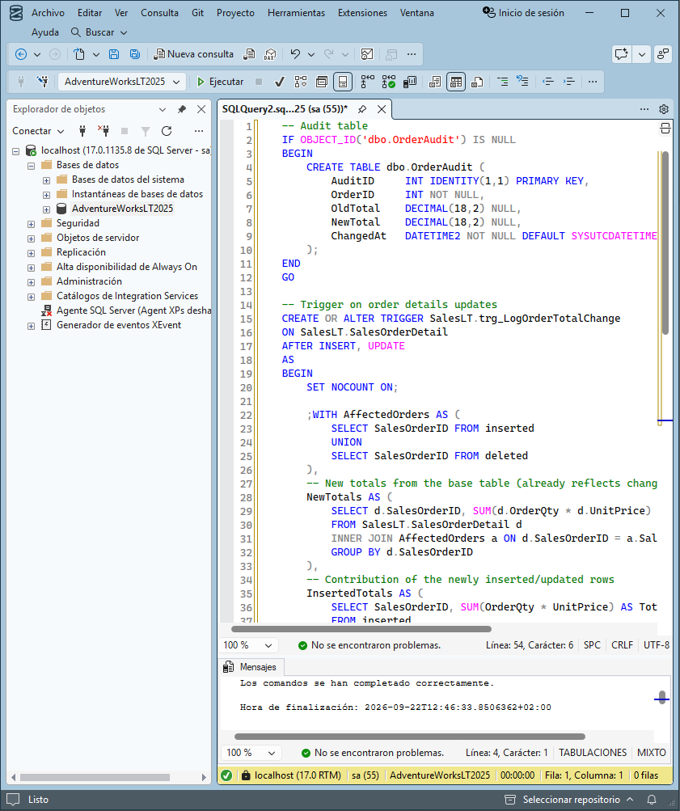

> Detalle que conviene tener presente: el trigger calcula los totales como `OrderQty * UnitPrice`, mientras que el procedimiento y `fnOrderTotal` usan `LineTotal`, que es una columna calculada que además descuenta `UnitPriceDiscount`. En este laboratorio los dos valores coinciden porque ninguna línea tiene descuento, pero en un caso real con descuentos la auditoría registraría un importe distinto del total del pedido.

### 6.2 Probar el trigger

Se incrementa en 1 la cantidad de todas las líneas del último pedido y se consulta la auditoría:

```sql
UPDATE d
SET OrderQty = OrderQty + 1
FROM SalesLT.SalesOrderDetail d
WHERE d.SalesOrderID = (SELECT TOP 1 SalesOrderID FROM SalesLT.SalesOrderHeader ORDER BY SalesOrderID DESC);

SELECT TOP (5) * FROM dbo.OrderAudit ORDER BY AuditID DESC;
```

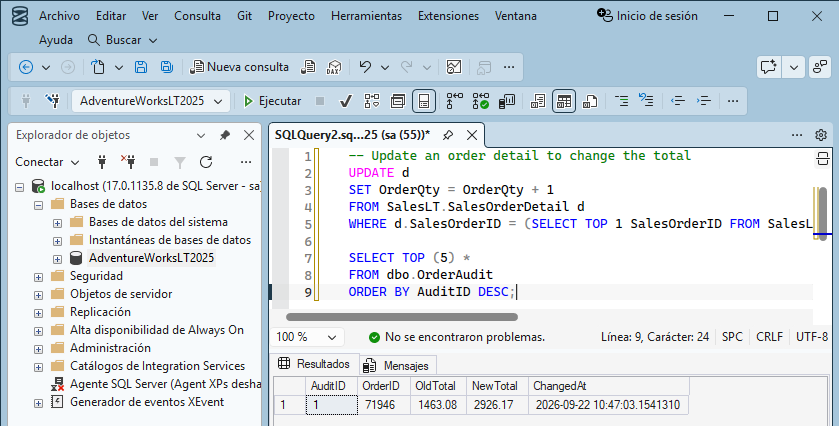

**Resultado:** aparece en `dbo.OrderAudit` una fila con el pedido 71946, su `OldTotal` (1463,08), el `NewTotal` (2926,17, prácticamente el doble al haber subido en 1 la cantidad de las dos líneas) y la fecha/hora en `ChangedAt`. El registro se ha generado **automáticamente**, sin que la consulta de `UPDATE` lo pida.

> La auditoría contiene una sola fila, y es lo esperado: la línea que insertó el procedimiento en el apartado 3 no aparece porque el trigger todavía no existía en ese momento. Un trigger solo reacciona a los cambios posteriores a su creación; si repitiera ahora la prueba del apartado 3, se registraría también esa inserción.

---

## 7. Limpieza (opcional)

Si no se va a volver a usar la base de datos: en SSMS → **Object Explorer** → **Databases** → clic derecho en **AdventureWorksLT2025** → **Delete** → marcar **Close existing connections** → **OK**.

---

## Conclusiones

| Objeto | Qué he aprendido |
|---|---|
| **Vista** | Encapsula un `JOIN` y expone los datos como una tabla virtual; no almacena datos. |
| **Procedimiento** | Agrupa validaciones y cambios en una transacción atómica con control de errores (`THROW`, `ROLLBACK`). |
| **Función escalar** | Centraliza un cálculo que devuelve un único valor y se usa dentro de un `SELECT`. |
| **TVF en línea** | Actúa como una vista parametrizada; se combina con otras tablas mediante `CROSS APPLY`. |
| **Trigger** | Se ejecuta solo ante `INSERT`/`UPDATE` y, con `inserted`/`deleted`, permite auditar cambios automáticamente, pero únicamente a partir del momento en que se crea. |

**Posibles mejoras:** unificar el criterio de cálculo para que el trigger use `LineTotal` como el resto de objetos y tenga en cuenta los descuentos; ampliar el procedimiento para que recalcule también `TaxAmt` y `Freight`, y para admitir varias líneas por pedido; añadir índices sobre las columnas usadas en `JOIN` y filtros; y conceder permisos sobre la vista para exponerla de forma segura.
